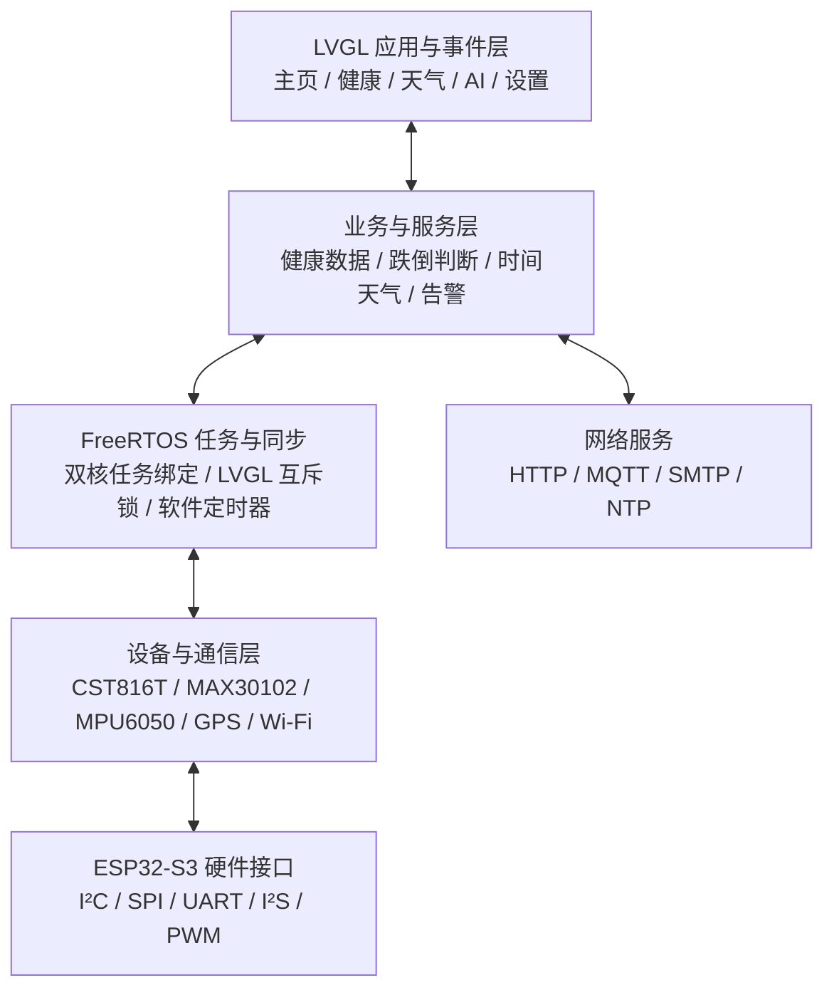
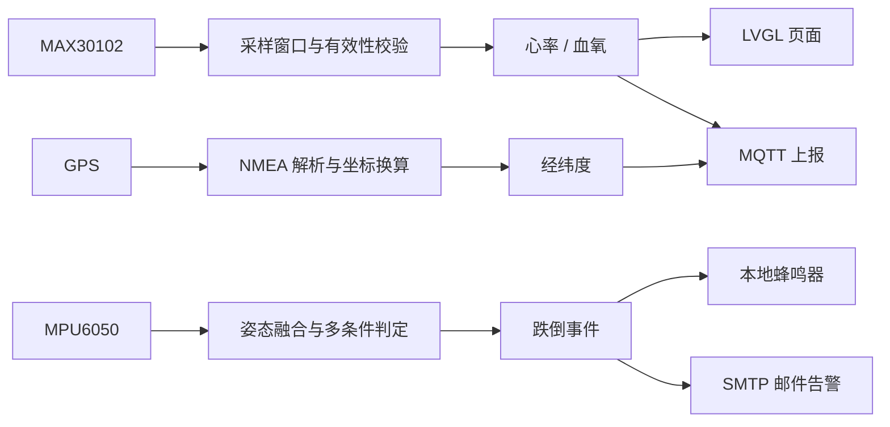

# 安护腕 ElderGuard Watch

> 基于 ESP32-S3、FreeRTOS 与 LVGL 的老人健康及跌倒监护终端

<div align="center">


面向老人居家与外出场景的可穿戴监护原型：在手表端完成生命体征采集、姿态与跌倒判断、GPS 定位、图形交互，并通过 MQTT 与 SMTP 建立远程数据和异常告警链路。

[项目仓库](https://github.com/MrW1027/ESP32-Watch) · [问题反馈](https://github.com/MrW1027/ESP32-Watch/issues)

</div>

---

## 项目背景

独居老人或慢病人群在日常活动中可能出现跌倒、身体异常或无法及时求助等情况。本项目尝试将健康采集、姿态分析、位置获取和远程告警集中到一块 ESP32-S3 可穿戴终端中，使设备既能在本地展示信息，也能在异常发生时主动通知联系人。

项目采用“驱动采集—任务处理—界面呈现—网络上报”的分层思路。当前仓库属于功能原型与工程实践项目，不是医疗器械，采集结果和跌倒判断不能用于医学诊断或紧急救援的唯一依据。

## 功能与完成状态

为了区分“代码存在”和“已经完成主工程集成”，本表使用以下状态：

- **已接入**：已经由当前 `src/main.cpp` 初始化或调度；
- **已实现**：核心代码已存在，但仍需要进一步完善可靠性；
- **独立原型**：已完成单独功能链路，尚未并入当前手表主入口；
- **待完善**：存在实现基础，但主流程或工程化工作尚未闭环。

| 模块 | 当前实现 | 状态 |
| --- | --- | --- |
| 图形界面 | 基于 LVGL 8.3 构建主页、健康、天气、AI 与设置页面，支持页面切换和背光调节 | 已接入 |
| 触摸交互 | 使用 CST816T 获取触摸状态及坐标，并注册为 LVGL 输入设备 | 已接入 |
| 心率/血氧 | MAX30102 采集红光与红外数据，滑动更新采样窗口并计算心率、血氧 | 已接入 |
| 姿态与跌倒检测 | MPU6050 采集六轴数据，结合卡尔曼滤波、合加速度、角速度和姿态角阈值判断跌倒 | 已接入 |
| GPS 定位 | 通过 UART2 接收 NMEA 数据，解析 `$GNGLL` 经纬度并转换为十进制度数 | 已接入 |
| 时间与天气 | Wi-Fi 联网后同步时间、请求天气数据，并通过 LVGL 定时器刷新页面 | 已接入 |
| MQTT 上报 | 使用 PubSubClient 按阿里云物模型格式上报心率、血氧、经纬度、温湿度等数据 | 已接入，需完善重连与凭据管理 |
| 跌倒告警 | 检测到跌倒后触发蜂鸣器，并动态创建 SMTP 邮件发送任务 | 已实现，需增加告警冷却与失败重试 |
| Web 配网 | 已实现 SoftAP、DNS、WebServer、网络扫描和表单接收逻辑 | 待完善：服务轮询任务尚未由主程序创建 |
| AI 语音对话 | 已包含唤醒词推理、PDM/I²S 录音、云端 STT、对话请求、TTS 与 I²S 播放链路 | 独立原型：尚未并入当前主入口 |
| 血压数据 | MQTT 数据结构中保留血压字段 | 演示数据：当前未接入血压传感器 |

## 系统架构



### 核心数据流



## FreeRTOS 任务设计

当前主程序创建 4 个常驻任务，并利用 ESP32-S3 双核进行职责划分：

| 任务 | CPU 核心 | 优先级 | 栈空间 | 职责 |
| --- | ---: | ---: | ---: | --- |
| `lvgl_handler` | Core 0 | 2 | 8192 B | 周期调用 `lv_timer_handler()`，处理界面刷新和 LVGL 定时器 |
| `gps_task` | Core 1 | 3 | 4096 B | 接收 UART2 数据并解析 GPS 经纬度 |
| `MPU6050_task` | Core 1 | 2 | 8192 B | 采集六轴数据、计算姿态并执行跌倒判定 |
| `max30102_task` | Core 1 | 4 | 4096 B | 连续采集光电容积脉搏波并计算心率、血氧 |

设计要点：

- 将 GUI 刷新固定在 Core 0，将传感器采集放在 Core 1，降低界面与连续采样相互阻塞的概率；
- MAX30102 任务保持较高优先级，减少连续采样窗口被长时间打断导致的数据失真；
- 使用互斥量保护 LVGL 处理入口，避免多个执行上下文同时访问非线程安全的图形对象；
- 各常驻任务保留延时，让出 CPU 时间片并避免忙等触发看门狗；
- 跌倒发生时动态创建 `sendEmail` 任务，使网络告警不直接阻塞姿态采集流程。

## 核心实现

### 1. LVGL 显示与触摸适配

- 通过 `my_disp_flush()` 将 LVGL 绘制缓冲区刷新到 TFT_eSPI；
- 通过 `my_touchpad_read()` 读取 CST816T 坐标，并映射为 LVGL Pointer 输入事件；
- 使用硬件定时器每 1 ms 调用 `lv_tick_inc(1)`，为 LVGL 提供系统节拍；
- 通过 LVGL 软件定时器刷新时间、天气、心率、血氧和 MQTT 数据；
- 通过 PWM 控制屏幕背光，支持设置页面动态调节亮度。

### 2. 心率与血氧采集

MAX30102 使用独立的 `Wire1` I²C 总线。程序先采集 100 组红光/红外数据形成初始窗口，再以 25 组数据为步长滑动更新，并调用算法计算心率与血氧。

为避免无效数据直接进入 UI 和云端，代码结合算法有效标志与合理区间进行二次筛选：

- 心率仅在有效标志成立且处于 50～150 bpm 时更新；
- 血氧仅在有效标志成立且处于 40%～100% 时更新；
- 页面定时器只在取得非零结果后取消“等待测量”提示。

### 3. 姿态融合与跌倒判断

MPU6050 通过软件 I²C 读取加速度计和陀螺仪原始数据。程序分别计算合加速度、合角速度和姿态角，并使用卡尔曼滤波融合 Roll/Pitch。

当前跌倒判定不是单一阈值触发，而是同时检查：

1. 低加速度或冲击加速度；
2. 较高角速度；
3. Roll 或 Pitch 出现明显姿态变化。

三个条件同时成立后，系统触发蜂鸣器并创建邮件告警任务。该方式能够减少仅由快速挥动或短时姿态变化造成的误判，但阈值仍需要结合佩戴位置和真实动作样本继续标定。

### 4. GPS 定位

- GPS 模块通过 UART2 以 9600 baud 接入；
- 按行读取 NMEA 数据并筛选 `$GNGLL` 语句；
- 解析前检查字段数量和经纬度字段是否为空；
- 将 NMEA 的“度分”格式转换为十进制度数，供界面或 MQTT 上报使用。

### 5. 网络通信与异常告警

- **Wi-Fi**：优先使用设备保存的网络信息，连接超时后进入 SoftAP 配网页面；
- **HTTP/NTP**：联网后获取天气数据并同步系统时间；
- **MQTT**：使用 PubSubClient 对接阿里云 IoT 平台，按物模型属性格式周期发布数据；
- **SMTP**：跌倒事件触发后发送邮件通知，并输出发送状态用于串口诊断。

当前 MQTT 上报中的血压字段为演示常量，不代表实际测量结果；心率、血氧和 GPS 字段来自传感器或定位模块。

### 6. AI 语音功能原型

仓库中的 `lib/mylib/my_ai_chat.cpp` 保留了一条相对完整的语音交互实验链路：

```text
PDM/I²S 录音
  → Edge Impulse 唤醒词推理
  → 百度语音识别（STT）
  → 对话服务请求
  → 百度语音合成（TTS）
  → MAX98357A / I²S 音频播放
```

该文件目前拥有独立的 `setup()`、`loop()` 和语音任务，未由 `src/main.cpp` 调用，因此应视为独立原型，而不是当前手表固件已经完整交付的功能。后续需要完成入口重构、任务资源评估、凭据外置和 UI 事件接入后再合并到主流程。

## 硬件接口

以下引脚来自当前仓库源码；显示屏 SPI 引脚由本机 TFT_eSPI 配置决定，仓库中未提供统一的 `User_Setup`。

| 模块 | 接口 | 引脚/配置 |
| --- | --- | --- |
| CST816T 触摸 | I²C | SDA GPIO17、SCL GPIO16、RST GPIO18、INT GPIO8 |
| MAX30102 | I²C (`Wire1`) | SDA GPIO48、SCL GPIO47，400 kHz |
| MPU6050 | 软件 I²C | SCL GPIO1、SDA GPIO2 |
| GPS | UART2 | RX GPIO40、TX GPIO39，9600 baud |
| TFT 显示屏 | SPI | 240 × 280；具体 SPI 引脚由 TFT_eSPI 配置文件定义 |
| 屏幕背光 | PWM | GPIO4 |
| 蜂鸣器 | GPIO | GPIO45 |
| I²S 功放原型 | I²S TX | BCLK GPIO12、LRCK GPIO13、DOUT GPIO11 |
| PDM 麦克风原型 | I²S RX/PDM | CLK GPIO14、DATA GPIO21 |

## 软件栈

| 层级 | 组件 |
| --- | --- |
| 主控与框架 | ESP32-S3、Arduino Framework、FreeRTOS |
| 图形界面 | LVGL 8.3、TFT_eSPI、GUI Guider 生成代码 |
| 传感器 | CST816T、MAX30102、MPU6050、GPS |
| 网络协议 | Wi-Fi、HTTP、NTP、MQTT、SMTP |
| 数据处理 | ArduinoJson、心率血氧算法、卡尔曼滤波、NMEA 解析 |
| 语音原型 | Edge Impulse、百度 STT/TTS、I²S/PDM |
| 工程管理 | PlatformIO、Git |

## 项目结构

```text
ESP32-Watch/
├── src/
│   └── main.cpp                         # 主固件入口、外设初始化与任务创建
├── lib/
│   ├── mylib/                           # 业务、传感器与网络模块
│   │   ├── WiFiUser.*                   # Wi-Fi 连接与 Web 配网
│   │   ├── my_max30102.*                # 心率/血氧采集
│   │   ├── my_mpu6050.*                 # 姿态解算与跌倒检测
│   │   ├── my_I2c.*                     # MPU6050 软件 I²C
│   │   ├── my_gps.*                     # GPS 数据解析
│   │   ├── my_mqtt.*                    # MQTT 数据上报
│   │   ├── my_smtp.*                    # SMTP 邮件告警
│   │   ├── my_signal.*                  # 时间、天气与蜂鸣器
│   │   ├── my_timer.*                   # LVGL 数据刷新定时器
│   │   └── my_ai_chat.*                 # AI 语音独立原型
│   ├── generated/                       # GUI Guider 生成的 LVGL 页面与事件代码
│   ├── Arduino-CST816T-Library/         # 已本地化的触摸驱动源码
│   └── wakeup_detect_*_inferencing/      # Edge Impulse 唤醒词模型与运行库
├── lessons/                             # 项目学习笔记
├── lv_conf.h                            # LVGL 配置
├── platformio.ini                       # PlatformIO 环境与依赖
├── .gitignore                           # 构建产物和本地配置忽略规则
└── README.md
```

`Arduino-CST816T-Library` 已由 Git 子模块转换为仓库内普通源码文件，克隆仓库后不需要再执行 `git submodule update`。

## 构建与运行

### 1. 准备环境

- Visual Studio Code；
- PlatformIO IDE 扩展；
- 支持数据传输的 USB 线；
- ESP32-S3 开发板及对应传感器。

### 2. 获取源码

```bash
git clone https://github.com/MrW1027/ESP32-Watch.git
cd ESP32-Watch
```

### 3. 检查本地硬件配置

构建前请根据实际硬件完成以下检查：

1. 在 TFT_eSPI 中选择与屏幕控制器和 SPI 接线一致的配置；
2. 将 Wi-Fi、天气接口、MQTT、SMTP 和语音服务参数替换为自己的配置；
3. 不要把真实密码、Token、API Key 或邮箱授权码提交到公开仓库；
4. 如果只构建手表主固件，应先将 AI 语音原型与主固件构建入口隔离，避免独立 `setup()/loop()` 与主入口冲突。

### 4. PlatformIO 命令

```bash
# 编译
pio run

# 上传
pio run --target upload

# 打开串口监视器
pio device monitor

# 清理构建缓存
pio run --target clean
```

串口监视器波特率为 `115200`，上传速度在 `platformio.ini` 中配置为 `921600`。

> 说明：本次 README 整理基于静态源码核对，未在当前检查环境中执行完整 PlatformIO 编译和实机回归。硬件接线、TFT_eSPI 本地配置及云端服务参数不同，均可能影响复现结果。

## 调试与问题定位思路

项目中可复用的排查路径包括：

### 传感器无数据或数据异常

1. 先检查供电、GND 和总线接线；
2. 根据源码确认各设备是否使用同一 I²C 控制器，避免只修改通用 `Wire` 而遗漏 `Wire1` 或软件 I²C；
3. 通过串口观察设备初始化信息、原始采样值和算法有效标志；
4. 将“总线读取”“原始数据”“算法结果”“UI 更新”分层验证，定位问题发生在哪一层；
5. 对心率和血氧同时检查有效标志与数值区间，避免把算法无效输出误判为硬件故障。

### 界面卡顿或看门狗复位

1. 检查任务循环中是否保留 `delay()`/`vTaskDelay()`；
2. 检查耗时网络请求是否运行在高频采集路径中；
3. 检查 LVGL 是否发生跨任务并发访问，并通过互斥量保护；
4. 使用串口时间戳逐段测量初始化和任务执行耗时，确认阻塞位置；
5. 根据任务职责调整核心绑定、优先级和栈空间，而不是只增加延时掩盖问题。

### 跌倒误报或重复告警

1. 分别输出合加速度、合角速度、Roll 和 Pitch；
2. 复现静止、快走、挥手、坐下和模拟跌倒等动作，观察阈值边界；
3. 使用多条件组合判断，避免单一加速度阈值触发；
4. 增加持续时间窗口、告警冷却和用户取消机制；
5. 对 SMTP 发送失败增加重试上限，避免异常时反复创建任务。

## 团队协作与工作重点

本项目包含团队协作代码、GUI 工具生成代码以及第三方开源组件。本仓库由 [MrW1027](https://github.com/MrW1027) 整理维护，重点展示以下嵌入式工作：

- 基于 ESP32-S3 双核 FreeRTOS 的任务划分、优先级配置与运行资源协调；
- MAX30102、MPU6050、GPS 等设备的数据采集、有效性判断与业务接口封装；
- 基于卡尔曼滤波和多阈值条件的姿态分析与跌倒告警链路；
- LVGL 显示、触摸输入、软件定时刷新与传感器数据联动；
- MQTT、SMTP、HTTP/NTP 等网络能力与设备数据链路集成；
- 通过串口日志、分层验证、任务调度和软硬件联合排查定位问题。

## 已知限制与后续计划

- [ ] 将账号、密码、Token 和 API Key 移出源码，改为本地配置文件或安全注入；
- [ ] 完成已泄露测试凭据的轮换，并清理公开 Git 历史中的敏感信息；
- [ ] 将 AI 语音代码移动为独立示例或重构为可由主程序调用的组件；
- [ ] 在主程序中接入 Web 配网服务轮询与断线重连；
- [ ] 为 MQTT 和 SMTP 增加超时、退避重连、失败重试和状态反馈；
- [ ] 为跌倒检测增加时间窗口、告警冷却和用户取消流程；
- [ ] 将云端血压演示字段替换为真实传感器数据，或从正式数据模型中删除；
- [ ] 补充原理图、实物效果图、编译日志和连续运行测试记录。

## 安全说明

公开仓库中不得保存真实 Wi-Fi 密码、邮箱授权码、MQTT 密钥、API Key 或 Access Token。若凭据曾经提交到 Git，即使后续从最新代码中删除，仍可能从历史提交中恢复；应立即在对应平台撤销或轮换凭据，并在必要时清理 Git 历史。

建议将私密配置集中到不纳入版本控制的文件，例如：

```cpp
// config_local.h（仅作结构示例，不要提交真实值）
#define WIFI_SSID       "YOUR_WIFI_SSID"
#define WIFI_PASSWORD   "YOUR_WIFI_PASSWORD"
#define MQTT_USERNAME   "YOUR_MQTT_USERNAME"
#define MQTT_PASSWORD   "YOUR_MQTT_PASSWORD"
#define SMTP_AUTH_CODE  "YOUR_SMTP_AUTH_CODE"
#define WEATHER_API_KEY "YOUR_WEATHER_API_KEY"
```

仓库中只保留 `config_example.h` 之类的占位模板，并通过 `.gitignore` 忽略真实配置文件。

## 第三方组件与使用说明

本仓库暂未提供统一的项目级开源许可证，主要用于学习交流、个人项目展示和技术复现。仓库中引用或包含的 ESP32 Arduino Core、FreeRTOS、LVGL、TFT_eSPI、CST816T 驱动、Edge Impulse SDK、GUI Guider 生成代码等组件，其版权和许可归各自作者或厂商所有，使用和再分发时请遵循对应许可证及使用条款。

如需将本项目用于商业产品、医疗健康设备或二次分发，请先完成代码来源、第三方许可证、数据合规和硬件安全评估。

## 联系方式

- GitHub：[@MrW1027](https://github.com/MrW1027)
- Repository：[MrW1027/ESP32-Watch](https://github.com/MrW1027/ESP32-Watch)
- Issues：[提交问题](https://github.com/MrW1027/ESP32-Watch/issues)

---

如果这个项目对你有帮助，欢迎通过 Issue 提出改进建议。
